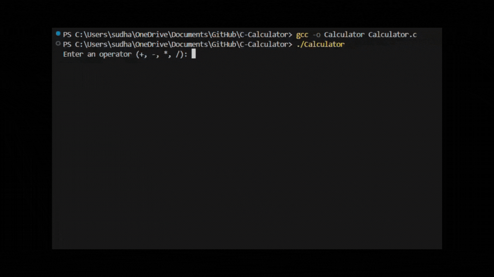

# C-Calculator
A simple command-line calculator that performs basic arithmetic operations (addition, subtraction, multiplication, division). This program is written in C and demonstrates the use of conditional statements and user input handling.

## Preview
<picture></picture>

## Compilation and Execution
1. To check whether MinGW is recognized by your system, use the following command:
   ```
   gcc -v
   ```
2. use the play button in the top right corner to run and debug the code.

3. To compile the game, use the following command:
   ```
   gcc -o Calculator Calculator.c
   ```

   To run the compiled program:
   ```
   ./Calculator
   ```

   If you encounter any issues setting up MinGW on Windows, refer to this guide: 
   [How to run a C program in Visual Studio Code](https://www.javatpoint.com/how-to-run-a-c-program-in-visual-studio-code)
  
## Example Input and Output
1. Addition (+):
   
   Input:
   ```
   Enter an operator (+, -, *, /): +
   Enter the first number: 2
   Enter the second number: 3
   ```
   Output:
   ```
   2.00 + 3.00 = 5.00
   ```
2. Subtraction (-):
   
   Input:
   ```
   Enter an operator (+, -, *, /): -
   Enter the first number: 5.5
   Enter the second number: 2.2
   ```
   Output:
   ```
   5.50 - 2.20 = 3.30
   ```
3. Multiplication (*):
   
   Input:
   ```
   Enter an operator (+, -, *, /): *
   Enter the first number: 4
   Enter the second number: 2.5
   ```
   Output:
   ```
   4.00 * 2.50 = 10.00
   ```
4. Division (/), Valid Division
   
   Input:
   ```
   Enter an operator (+, -, *, /): /
   Enter the first number: 10
   Enter the second number: 2
   ```
   Output:
   ```
   10.00 / 2.00 = 5.00
   ```
5. Division (/), Division by Zero
   
   Input:
   ```
   Enter an operator (+, -, *, /): /
   Enter the first number: 10
   Enter the second number: 0
   ```
   Output:
   ```
   Error! Division by zero.
   ```
6. Invalid Operator
   
   Input:
   ```
   Enter an operator (+, -, *, /): %
   Enter the first number: 10
   Enter the second number: 2
   ```
   Output:
   ```
   Invalid operator!   
   ``` 

## Dependencies
Standard C library: 
- [MinGW](https://sourceforge.net/projects/mingw/)
- [C/C++](https://marketplace.visualstudio.com/items?itemName=ms-vscode.cpptools)